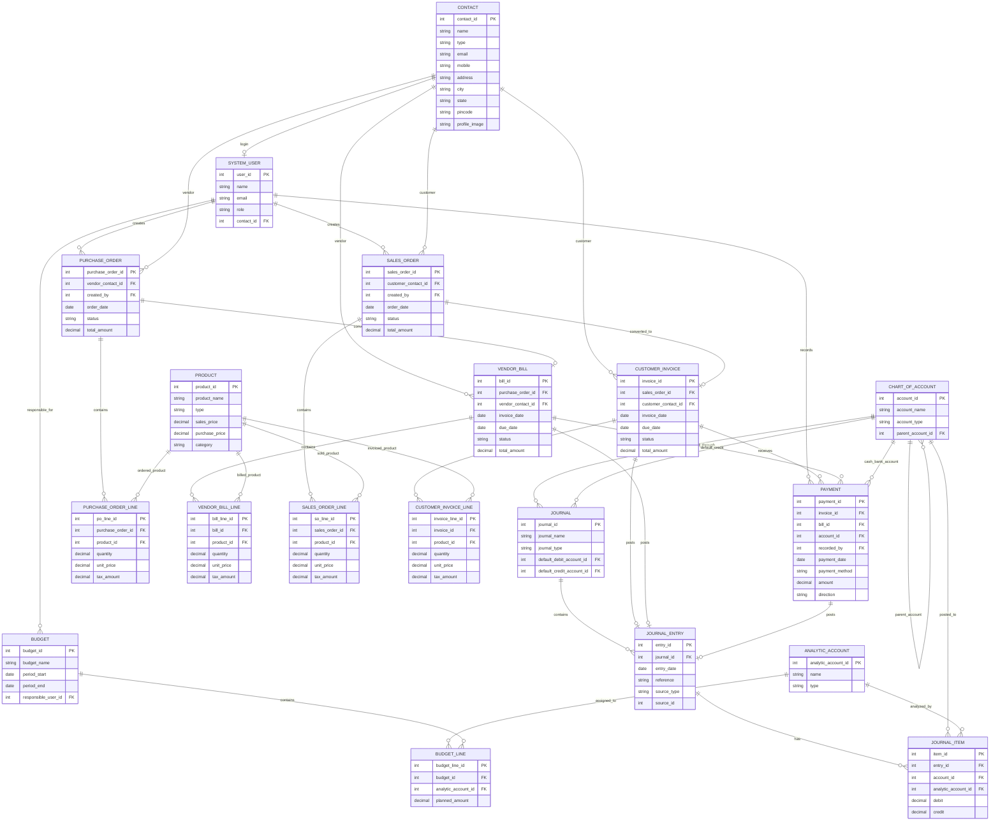

# Urban Furniture Accounting System - ER Diagram

## Notes

- `PAYMENT` should reference either a customer invoice or a vendor bill.
- `JOURNAL_ITEM` stores the debit and credit postings used to generate financial reports.
- Balance Sheet, Profit & Loss, and Budget Reports are generated from transaction data.
